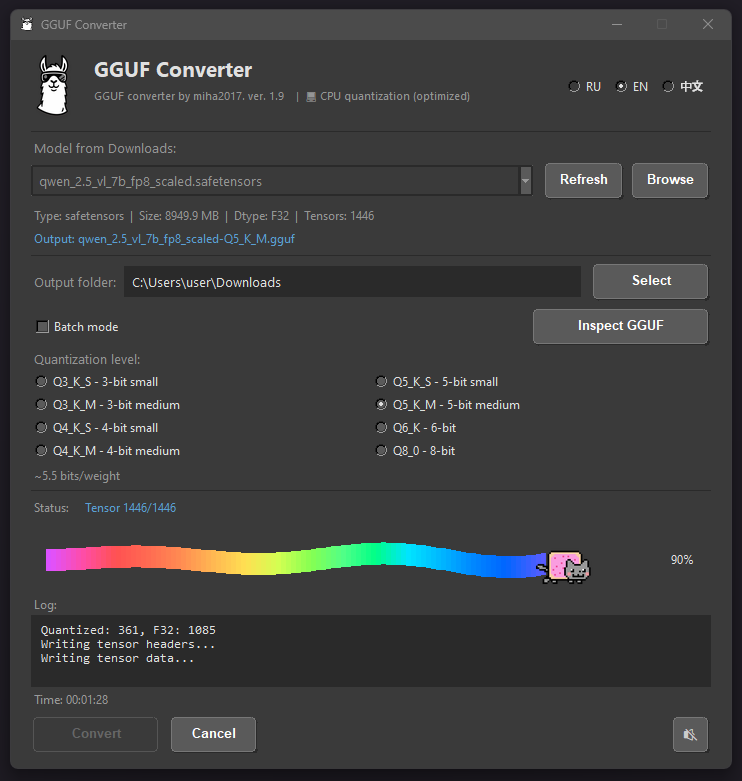

# GGUF Converter

<p align="center">
  
</p>

Универсальная утилита для конвертации AI моделей в формат GGUF с квантизацией.

## Возможности

- 🔄 Конвертация моделей из форматов `.safetensors`, `.pt`, `.pth`, `.bin`
- 📊 8 уровней квантизации (Q3_K_S до Q8_0)
- 📁 Автоматическое сканирование папки Downloads
- 🔍 Умное извлечение имени модели из метаданных
- 📂 **Выбор выходной папки** (сохраняется между сессиями)
- 📦 **Пакетная конвертация** нескольких файлов
- 🔎 **Инспекция GGUF файлов** (просмотр тензоров, экспорт CSV)
- 🌍 Мультиязычность: Русский, English, 中文
- ⚡ Обработка FP8 моделей (автоматическая деквантизация)
- 🎯 Смешанная квантизация Q4_K_M (важные слои в Q6_K)
- 🆕 **Поддержка AWQ моделей** (автоматическая деквантизация INT4 → FP16)

## Установка

### Требования

- Python 3.8+
- Windows 10/11

### Зависимости

```bash
pip install numpy pillow safetensors pywin32
```

Опционально для PyTorch моделей:
```bash
pip install torch
```

## Использование

### Запуск

```bash
python gguf_converter.py
```

Или используйте `run_converter.bat` для быстрого запуска.

### Процесс конвертации

1. Выберите модель из списка (автоматически сканируется папка Downloads)
2. Или нажмите "Обзор" для выбора файла вручную
3. Выберите папку для сохранения (по умолчанию Downloads)
4. Выберите уровень квантизации
5. Нажмите "Конвертировать"
6. Готовый файл появится в выбранной папке

### Пакетная конвертация

1. Включите чекбокс "Пакетный режим"
2. Выберите несколько файлов в диалоге
3. Нажмите "Конвертировать"
4. Все файлы будут обработаны последовательно
5. В конце появится сводка результатов

### Инспекция GGUF файлов

1. Нажмите кнопку "Инспекция GGUF"
2. Выберите GGUF файл
3. Просмотрите информацию о тензорах:
   - Имя, форма, тип данных, размер
   - Общее количество тензоров
   - Версия GGUF формата
4. Экспортируйте в CSV или скопируйте в буфер обмена

## Уровни квантизации

| Тип | Описание | Размер |
|-----|----------|--------|
| Q3_K_S | 3-bit small | ~2.5 bits/weight |
| Q3_K_M | 3-bit medium | ~3 bits/weight |
| Q4_K_S | 4-bit small | ~4 bits/weight |
| Q4_K_M | 4-bit medium | ~4.5 bits/weight ⭐ |
| Q5_K_S | 5-bit small | ~5 bits/weight |
| Q5_K_M | 5-bit medium | ~5.5 bits/weight |
| Q6_K | 6-bit | ~6 bits/weight |
| Q8_0 | 8-bit | ~8 bits/weight |

⭐ Q4_K_M — рекомендуемый баланс качества и размера (использует смешанную квантизацию: важные слои в Q6_K)

## Структура проекта

```
gguf-converter-v1/
├── gguf_converter.py    # Основной скрипт
├── quantizer.py         # Логика квантизации
├── awq_support.py       # Деквантизация AWQ
├── ui_widgets.py        # UI компоненты
├── translations.py      # Переводы (RU/EN/ZH)
├── settings.json        # Настройки пользователя
├── run_converter.bat    # Лаунчер для Windows
├── images/
│   ├── logoLLM.png      # Логотип
│   ├── logoLLM.ico      # Иконка окна
│   └── nayan.gif        # Анимация Nyan Cat
├── music/               # Папка для музыки
│   └── *.mp3            # MP3 файлы для фона
├── tools/               # Утилиты для анализа
│   ├── analyze_source_model.py    # Анализ safetensors
│   ├── check_quantization.py      # Проверка квантизации
│   ├── compare_gguf_models.py     # Сравнение GGUF
│   ├── compare_tensors_detailed.py # Детальное сравнение
│   ├── compare_two_models.py      # Сравнение двух моделей
│   ├── test_quantization_types.py # Тесты квантизации
│   └── test_awq_support.py        # Тесты AWQ поддержки
└── README.md            # Документация
```

## Музыка

Поместите MP3 или WAV файлы в папку `music/` для фоновой музыки.
Кнопка 🔊 включает/выключает звук. Музыка играет только во время конвертации.

## Особенности

### Защита от двойного запуска
Утилита использует Windows Mutex для предотвращения запуска нескольких копий.

### Умное определение имени модели
Имя выходного файла извлекается в порядке приоритета:
1. **Метаданные safetensors** (высший приоритет):
   - `modelspec.title` — стандартная спецификация
   - `ss_output_name` — Kohya trainer
   - `ss_sd_model_name` — Kohya SD model
   - `model_name`, `name`, `title` — общие ключи
2. **config.json** — для generic файлов (model.safetensors)
3. **Очищенное имя файла** — удаляются суффиксы `-fp16`, `_pruned` и т.д.
4. **Имя папки** — только если файл называется generic

### Обработка FP8 моделей
- Автоматическое обнаружение FP8 весов
- Деквантизация FP8 → FP32 перед квантизацией
- Фильтрация служебных тензоров (scale, zero_point)

### Смешанная квантизация (Q4_K_M)
Для Q4_K_M используется интеллектуальная квантизация:
- Важные слои (attention, первые блоки) → Q6_K
- Остальные слои → Q4_K
- Bias и нормализация → F32

### Поддержка AWQ моделей
AWQ (Activation-aware Weight Quantization) модели автоматически обнаруживаются и конвертируются:

**Как это работает:**
1. Автоматическое обнаружение AWQ формата (тензоры `.qweight`, `.qzeros`, `.scales`)
2. Деквантизация INT4 → FP16 по формуле: `weight = (qweight - qzeros) * scales`
3. Стандартная GGUF квантизация деквантизированных весов

**Поддерживаемые AWQ модели:**
- Любые AWQ модели в формате `.safetensors`
- Размеры групп: 32, 64, 128 (определяются автоматически)
- 4-битная квантизация (INT4)

**Требования к памяти:**
- AWQ 7B модель: ~4GB на диске → ~14GB FP16 → ~4GB GGUF Q4_K_M
- Используется потоковая деквантизация для минимизации пикового потребления памяти

**Примеры моделей:**
- `TheBloke/Llama-2-7B-AWQ`
- `TheBloke/Mistral-7B-v0.1-AWQ`
- Любые AWQ модели с HuggingFace

### Тёмная тема
Интерфейс использует тёмную цветовую схему, комфортную для глаз.
Поддерживается тёмный заголовок окна в Windows 11.

## Changelog

### v1.9
- 🆕 **Поддержка AWQ моделей** — автоматическая деквантизация INT4 → FP16
- 🔍 Автоопределение AWQ формата (qweight, qzeros, scales)
- ⚡ Потоковая деквантизация для экономии памяти
- 🧪 Набор тестов AWQ (`tools/test_awq_support.py`)

### v1.8
- ⚡ Оптимизация анимации прогресс-бара (3x быстрее)
- 🔧 Использование предсозданных canvas элементов вместо delete/create
- 🎵 Исправлено воспроизведение музыки - теперь случайный трек после окончания
- 🐛 Исправлено обрезание процентов справа
- 🎬 Независимый поток анимации - плавная анимация независимо от нагрузки CPU

### v1.7
- ⚡ Многопоточная квантизация (использует все ядра CPU)
- ⚡ Векторизованные функции квантизации (5-12x ускорение)
- 🔧 Асинхронное обновление UI через очередь
- 🐛 Удалены вызовы torch.cuda.empty_cache() (замедляли работу)

### v1.2
- ✨ Выбор выходной папки (сохраняется в настройках)
- ✨ Пакетная конвертация нескольких файлов
- ✨ Инспекция GGUF файлов (просмотр тензоров, экспорт CSV)
- 🐛 Исправлен краш при Q3 квантизации
- 🐛 Исправлена упаковка битов в Q5_K и Q6_K
- 📝 Добавлен вывод количества тензоров в лог

### v1.1
- ✨ Мультиязычность (RU/EN/ZH)
- ✨ Обработка FP8 моделей
- ✨ Смешанная квантизация Q4_K_M
- 🎨 Улучшенный интерфейс

### v1.0
- 🎉 Первый релиз

## Лицензия

MIT License

## Автор

miha2017

---

## 💰 Donate

Если проект оказался полезен, можете поддержать разработку:

| YooMoney (Россия) | Криптовалюта: USDT TRC20 |
|:---:|:---:|
|  |  |
| [yoomoney.ru/to/41001355824274](https://yoomoney.ru/to/41001355824274) | `TFZoJGcYd8z2QPokiZSBcZnrkTevEnxpyR` |

---

## ⚡ Контакты:

📧 thepuppeteer@internet.ru

*GGUF Converter v1.8*
